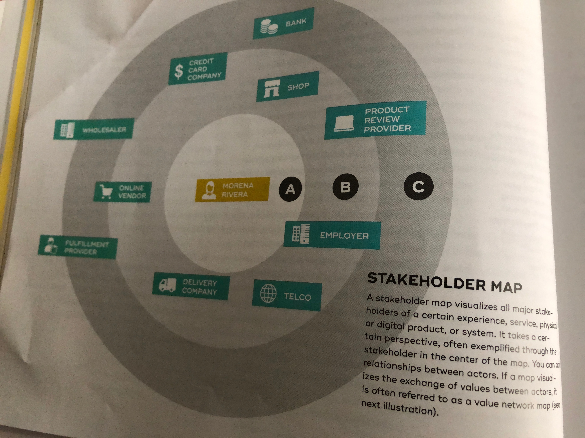
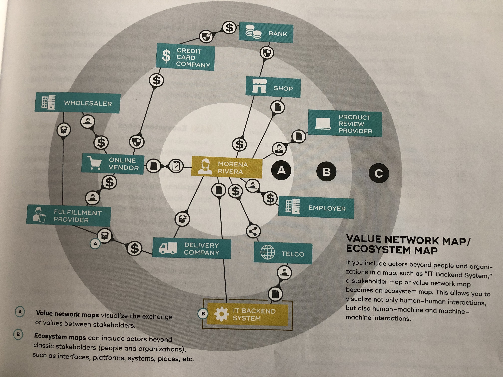

## 3.4 System Maps

A system map is a visual or physical representation of the main constituents of the system in which an organization, a service, or a digital/physical product is embedded. They can include a huge variety of constituents, such as people, stakeholders, processes, structures, services, physical products, digital products, channels, platforms, places, pathways, insights, causes, effects, KPIs, and more. System maps are usually visualized on paper, as physical models, or as constellations with real people.

A visualization of a system usually takes a specific perspective at a specific moment in time. As ecosystems change over time, either several maps are needed to represent different states or a system or a dynamic approach can be used to illustrate changes over time.

By visualizing all the main components of a system, the interplay between these can be analyzed and designed. Complex systems become more comprehensible when they are visualized, which is particularly useful for wicked design problems. Systems maps can be used to map out not only existing ("current-state") systems, but also various scenarios of future ("future-state") systems to understand the impact of decisions, new components, or changed relationships. A system map can be used to find or predict intended or unintended benefits as well as disadvantages in the system. Affected stakeholders can be revealed and involved early in a project to increase buy-in and chances of success.

"System map" is a collective term for different visualizations that are often based on systems theory and/or systems thinking. The names of these visualizations may vary depending on your background or organization. The following three types of systems maps are often used in service design:

#### Stakeholder maps
A stakeholder map illustrates the various stakeholders involved in a specific experience. These maps can be used to understand who is involved, and how these people and organizations are connected.

#### Value network maps
A value network map is an extension of a stakeholder map. It illustrates the network of value exchanges between stakeholders. Value network maps are used to understand the flow of values, such as money, goods, services, information, or trust.

#### Ecosystem maps
An ecosystem map is a further extension of a stakeholder map or value network map. These maps are used to visualize complex systems that involve various constituents, such as humans, machines, interfaces, devices, platforms, systems, and so on, as well as their relationships and interdependencies.

### 3.4.1 Stakeholder maps
A stakeholder map illustrates the various stakeholders involved in an experience. It basically answers the question: "Who are the most important people and organizations involved in an experience?" By representing different customer groups or personas, frontstage and backstage employees or departments, partner organizations, as well as other stakeholders that might have a direct or indirect impact on the experience, the interplay between these various groups can be charted and analyzed. Stakeholder maps help us to understand which stakeholders are involved in this ecosystem, help to reveal existing relationships between these stakeholders and identify informal networks or frictions between stakeholders, and help us to find unseen business opportunities.

During a customer journey, customers interact with various internal and external stakeholders. Often customers don't realize which stakeholders are involved as they interact with websites, apps, machines, platforms, and more, not thinking about who is responsible for maintaining these systems and who is involved in handling their information. Stakeholder maps enable a design team to actively redesign a system by adding or eliminating certain stakeholders; by creating, changing, or eliminating relationships between stakeholders; or by deliberately strengthening or weakening relationships.

#### Sectors
The background of a stakeholder map depends on the purpose. A simple and very generic option is to have three circles representing different stakeholder groups: (A) customers, (B) internal stakeholders, and (C) external stakeholders. Alternatively, the three circles could refer to the level of impact stakeholders have: (A) essential stakeholders, (B) important stakeholders, and (C) other stakeholders.

#### Stakeholders
Stakeholders are positioned on the map in a particular sector and can be arranged according to departments or groups (e.g., depending on how customers perceive them). Customer-centered organizations often put the customer in the center of a map, but depending on the purpose of the stakeholder map it can also be centered around a specific department for projects on internal services or around a specific employee for projects on employee experience.

#### Relationships
Relationships between stakeholders are visualized and should be detailed out in a description. Relationships can illustrate both formal and informal networks; they can show which stakeholders act as a hub or bottleneck in a system, and also reveal formal and informal decision-making authority or power structures.

### 3.4.2 Value network maps
A value network map is an extension of a stakeholder map. Instead of merely describing the relationships between stakeholders, a value network details out the exchange of value between stakeholders. "Value" can refer to physical products and services as well as financial values. A simple value exchanges could be: stakeholder A gives money to B, stakeholder B provides a service in return to A. Values exchanged can also be less tangible, such as information, trust, or status.

Like stakeholder maps, value network maps visualize systems from a specific perspective at a specific moment in time. In extension to a simple stakeholder map, value network maps can show the flow of values through a system, such as information flows or financial streams in a network.

#### Sectors
The template of a value network map will depend on the project: from simple and rather generic ones (like the three circles) to backgrounds visualizing different departments or geographies like a city or country.

#### Stakeholders
Stakeholders are positioned on the map in a particular sector and can be arranged according to departments or groups as customers perceive them. Customer-centered organizations put the customer in the center of the map, but a map can also be centered around a specific department or a specific employee.

#### Value exchanges
The exchanges or values between stakeholders are visualized with separate arrows from one stakeholder to another. Beside a description, icons help to illustrate the value exchange. In almost all cases, value exchanges take place in both directions, reflecting the saying "there's no such thing as a free lunch."

### 3.4.3 Ecosystem maps
An ecosystem map is an extension of a stakeholder map or value network map. Such maps include not only stakeholders, but also other actors beyond people and organizations. An ecosystem map includes not only human-human interactions, but also human-machine and machine-machine interactions.

Nowadays, there is no service or physical product without additional or connected services or products, whether physical or digital. Sometimes, these connections are established through automated machine-machine interactions - sometimes even without any interfaces.

An ecosystem map visualizes the whole system of involved actors - humans, machines, interfaces, devices, platforms, and systems. Because systems can become very complex, ecosystem maps often need different zoom levels, from system overviews without any details to very detailed views of subsystems.

Ecosystem maps show the following:

#### Sectors
Ecosystem maps can use a variety of sectors to structure a map depending on its focus. Besides generic templates (like the three circles), backgrounds can also represent different organizations, departments, or geographies (e.g., a building, city, or country).

#### Actors
Actors in an ecosystem map can be whatever makes sense to visualize a system: people, departments, organizations, places, machines, interfaces, devices, platforms, systems, and so on.

#### Relationships or value exchanges
Ecosystem maps can use anything to describe the interaction between actors, from simple descriptions of relationships to illustrations of value exchanges.

### Stakeholder terminology
The terminology used in service design differs across organizations and cultures - particularly when it comes to the different players involved. As this can be confusing, this list shows how terminology is used in this book:

* **Stakeholder** A person, or organization that is somehow connected to or has an interest in a project, organization, or product (including everyone listed here).

* **User** A person who uses a service or physical/digital product.

* **Customer** A person who buys services or physical/digital products.

* **Client** Although "customer" and "client" are often used synonymously, differentiating these terms often makes work easier. In a service design context, a client is a person, group, or organization that orders and purchases (service design) services from an agency, in-house design department, or consultant.

* **Service delivery team** A person, group, or department within an organization that is responsible for providing services to users or customers.
  * **Employee** A person employed by an organization.
  * **Frontline staff** A person, group, or department within an organization that provides services in direct interaction with users and customers.
  * **Support staff** A person, group, or department within an organization that supports frontline staff without direct interaction with users and customers.

* **Design team** A group of people that is involved in the service design process.
  * **Core (service) design team** A (small) group or people that manage a service design project, including process and activity planning, tools and methods selection, and facilitation. They are typically experts on service design.
  * **Extended (service) design team** A (larger) group of people that are involved in different activities or a service design project. They are typically cross-functional and multidisciplinary experts with specific competencies related to the subject matter or a service design project.
  * **Agency** A person, group, or organization that provides services (design, facilitation, consultation) for other persons, groups, or organizations (i.e., the client) in the development or assessment of a service.
  * **Consultant** An internal or external person, group, or organization that temporarily provides (service design) consultation.
