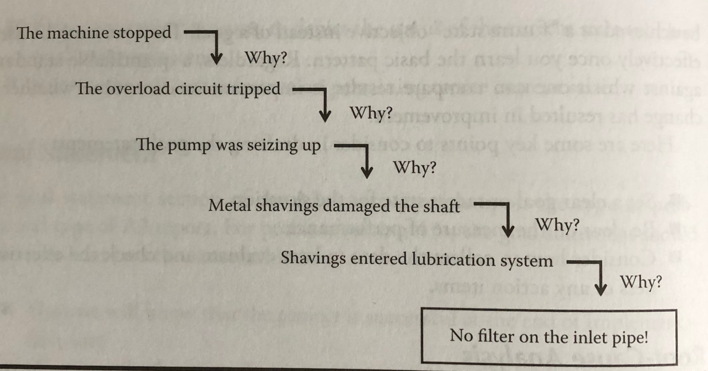
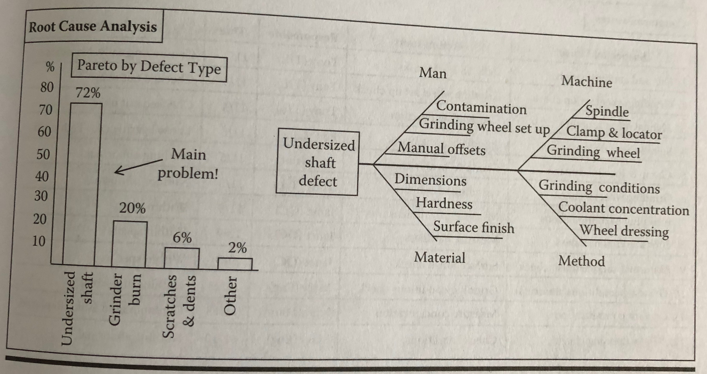

# A3 Thinking
## Practical Problem Solving

### Identifying the Root Cause
At the point of cause, it is usually fairly straightforward to identify the direct cause of the problem. What is the immediate thing that is happening (or not happening) that is creating the problem? This should be confirmed through additional observation or experimentation, as it would be highly unproductive to implement a countermeasure that does not address the problem.

However, the most obvious cause is rarely they root cause. So the problem-solver continues the investigation until a root cause is found, on that if taken care of, would eliminate all future occurrences of the problem. A common method for investigating root cause is the five whys approach. The problem-solver asks, "Why is this problem occurring?" Upon answering it, he or she will have identified a cause to the observed effect. The problem-solver then asks the question again, this time turning the cause into an effect, to identify a deeper cause. The problem-solver continues this inquiry until recurrence can be prevented by addressing that cause. When completed, the problem-solver has a clear and coherent cause-effect chain that demonstrates an in-depth understanding of the problem in context, noting how the root cause is linked to the observed phenomenon. The cause-effect chain should be shared with others to verify that it is probable and reasonable.

In other cases, however, the root cause cannot be deduced from the five-whys technique, and structured tests or experiments are used to eliminate possible causes. For example, one of the authors once investigated a quality problem in the final honing process of a connection rod. The large end crankshaft hole of the connection rod was not staying parallel to the small end hole for connection to the piston pin. He identified six possible explanations for the cause of the problem but could determine the real cause of the problem only by testing each possible root cause in careful sequence with measurements at each step of the way. Finally, he confirmed that a previous process was the culprit and the small end hole was not being reamed correctly. A realignment of the spindle head and proper fastening of the bearings in the machine in question solved the problem.

In problems related to organizational processes, we have found Spear and Bowen's articulation of rules for the Toyota Production System (TPS) to be quite useful. [Decoding the DNA of the Toyota Production System](https://hbr.org/1999/09/decoding-the-dna-of-the-toyota-production-system) From their research, they distilled three rules that seem to govern how Toyota designs its work systems. They are as follows:
* Activities shall be specified according to content, sequence, timing, and outcome.
* Customer-supplier connections shall be clear, direct, and binary.
* Pathways that deliver a product or good shall be simple and direct.

In one of the author's work on hospital systems, we have not found a single instance where an operational problem did not have, at its root, a violation of one or more of the preceding three rules. In other words, every problem we observed resulted from a poorly specified activity, an unclear connection, or complicated or undefined pathway. Thus, as a rule of thumb, we would suggest that the root-cause investigation of process-related problems continue at least until one of these rules has been identified.

# The Problem-Solving A3 Report
## Storyline of the Problem-Solving A3

### Root-Cause Analysis
The report author should continue the investigation of the current condition until he or she uncovers the root cause of the problem symptoms identified in the current condition diagram. Failing to address the deeply rooted seed of the problem means it will likely recur. As mentioned in chapter 2, one common technique for root-cause analysis is the 5 Why's method. Using this deductive technique, the problem-solver simply asks a why question, approximately five times in a series, each time probing they next level of causality. Experience has shown that stopping at two or three whys usually means that the inquiry has not gone deep enough. Finding the root cause may also entail some experimentation. In other cases, an Ishikawa or fishbone diagram might be useful to determine some of the potential root causes.

Toyota's training documentation on A3 reports and problem solving goes to great lengths to emphasize the concept of the 5 Why's method of deduction when it comes to root-cause analysis. From hard work and experience, Toyota practiioners have learned that rarely is the first insight correct and is almost never the ultimate cause of the problem. Thus problem-solvers must develop the discipline of going beyond the superficial level.

To illustrate this point, consider a production downtime problem where a machine stops due to an alarm indication on the control panel. Initial production responses were to reset the overload relay; however, the problem recurred. Eventually, a damaged motor shaft on a pump unit was detected, and the shaft was replaced. Most companies would stop their problem-solving activities here. Unfortunately, in many cases such as this one, that action did not address the root cause of the problem. Odds are high that the problem will reoccur at some point in the future. Only by forcing the discipline of 5 Why's thinking can the problem-solver begin to approach the root cause of the problem.

If we carry the inquiry forward, as illustrated by figure 3.6, several steps are required to get at the real root cause of the problem--that is, metal shavings entering the lubrication system. This deductive-thinking process eventually leads to a better insight that attaching a filter to the lubrication inlet pipe is a suitable countermeasure that should establish true recurrence prevention of the problem. Stopping short of this level would not permanently solve the problem and would only delay its eventual return.

Of course, it is possible to go even further, such as asking why shavings enter the lubrication tank or why shavings are generated in the process at all. However, in this case, the fifth why-level countermeasure of attaching a strainer to the inlet pipe is deemed sufficient to solve the problem. If this were not sufficient, a more through countermeasure would be needed. It is the thinking process and ability to determine true cause and effect is critical. The repetition of asking "why?" over and over helps guide the process.

In practice, real problems often have multiple cause or have causes that are well hidden and cannot be deduced up front using the 5 Why's method. Thus, experimentation may be required to establish cause-and-effect relationships. For this reason, the 5 Why's are not always written out on the A3 report--after all, what would be forcing a process and not requiring thinking. However, root-cause analysis and critical thinking are always probed and challenged during the writing and review process of any A3.

Regardless of the technique used to determine the root cause, the goal of the root-cause analysis section is to show either through logical deduction or experimentation that cause and effect have been established. Most problem-solving efforts fall incredibly short of this goal. Problem-solving teams we have observed often list items that are perceived to be problems without establishing any basic level of proof, or they list items that are easy or popular. This is not acceptable in A3 thinking. Either a cause-and-effect relationship should be established or a structured set of experiments performed to test for cause and effect. Otherwise, the problem-solver is just guessing at the issues and practicing a form of the "ready, fire, aim" school of problem-solving.

Figure 3.7 displays an example of a root-cause analysis summarized from the machine shop scrap problem. After further investigation, the report author found that one particular type of problem, undersized shaft arm, accounted for 72 percent of the scrap in the grinding operations. In this case, it turned out that potentially multiple causes contributed to the quality problem. It would be too space-consuming to list several 5 Why's tress, so instead, a fishbone diagram was used to list the main causes potentially contributing to the problem in some fashion. In this case, direct causality has not been determined so countermeasures will be attempted in response to the different perceived causes. Effectiveness will then also be confirmed.

Here are some items to consider in drafting the root-cause analysis section:
* Be sure to show the root cause of the problem(s) identified in the current state.
* Separate symptoms and opinions from cause and effect determination.
* Consider what techniques are most useful for explaining root-cause insight: 5 Why's? Fishbone analysis? Other?
* Identify what tests might need to be performed in order to establish some level of certainty pertaining to cause and effect.
* Summarize the main findings of the root-cause analysis, visually, if possible.

## Reviewing Problem-solving A3s

#### Table 3.1 Review Questions for Problem-Solving A3 Reports
##### Root-cause analysis
* Is the analysis comprehensive at a broad level?
* Is the analysis detailed enough and did it probe deeply enough on the right issues?
* Is there evidence of proper five-whys thinking about the true cause?
* Has cause and effect been demonstrated or linked in some manner?
* Are all the relevant factors considered (human, machine, material, method, environment, measurement, and so on)?
